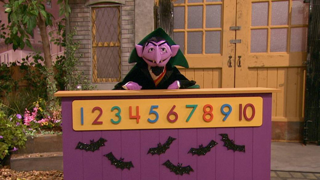

# Sesame street

This project is a reproduction of the classic developmental psychology study on the Sesame Street tv show. We will explore the data, create new columns for the changes in cognitive abilities, and we'll do a two sample t test on the change in literacy among the regular viewers.

For more details, see *G Is for Growing: Thirty Years of Research on Children and Sesame Street*
Routledge Communication Series
Editors	Shalom M. Fisch, Rosemarie T. Truglio

